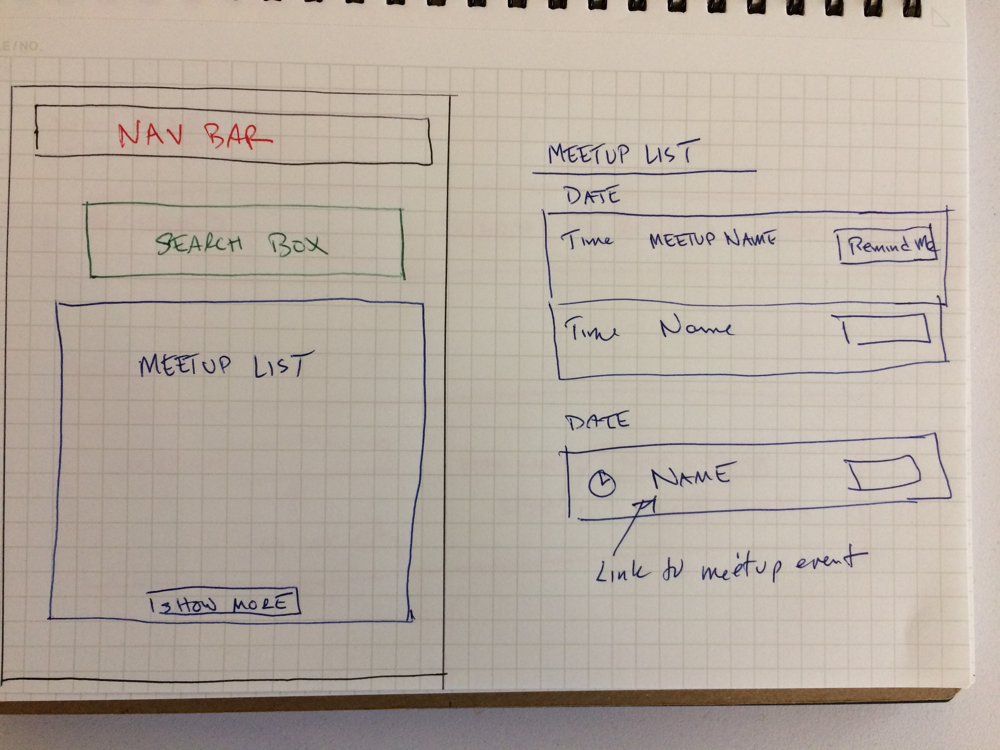
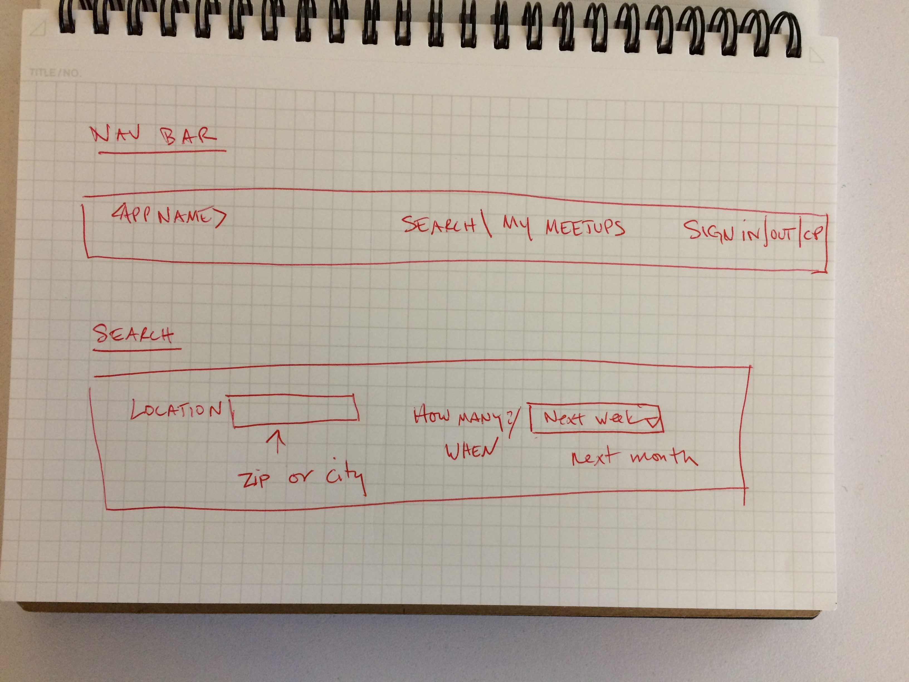

# Meetups for the non-committal WDI student

Oh, there are a lot of technical Meetups out there.  How can you paw through them all and remember what you might be interested in but not actually RSVP to the meetup?  Maybe you would just like to be reminded about it as it gets closer and THEN you can decide whether or not to sign up.

No worries, this app solves your committal problems.

We will paw through the Meetup.com technical meetups and let you choose which ones you are interested in - without having to sign up!  Then we will remind you as the date of the Meetup approaches and THEN you can decide whether or not to JOIN SOMETHING.

## Links

-  FRONT END REPO   https://github.com/prankmode/meetup-client
-  BACK END REPO    https://github.com/prankmode/meetup-server
-  FRONT END DEPLOYED    https://prankmode.github.io/meetup-client/
-  BACK END DEPLOYED    https://sleepy-bayou-40417.herokuapp.com/

## User stories

-  as a wdi student, i would like to know what meetups that are relevant to WDI are upcoming
-  as an introvert, i don't want to sign up for every event i might be interested in
-  as an introvert, i would like to select meetups that i am interested in without joining or RSVP'ing
-  as a user, I would like to be reminded when they are coming up so I could then sign up if I was still interested
- as a user, show me what i have asked to be reminded about
- as a user, let me define a group of topics to search
- as a user, send me a reminder

## General approach

I wanted to do an interface to Meetup.com that was very specific to our
time and needs at GA.  At this point, all tech meetups may be of interest, but how to
easily figure find the ones we would like to go to.  Additionally, on Meetup.com you have to join the group and RSVP to keep track.

My goal was to get the list of upcoming meetups and let the user go on a shopping spree with no committments!  All meetups can be returned for full price.

I built a lot of the server first - to make sure I could get the list of meetups.  Then it was a bunch of managing what list is displayed when and what to actually save.

## Wireframes

## Techonologies

KISS - Javascript, jQuery, Bootstrap, Ajax, Handlebars

## [License](LICENSE)
